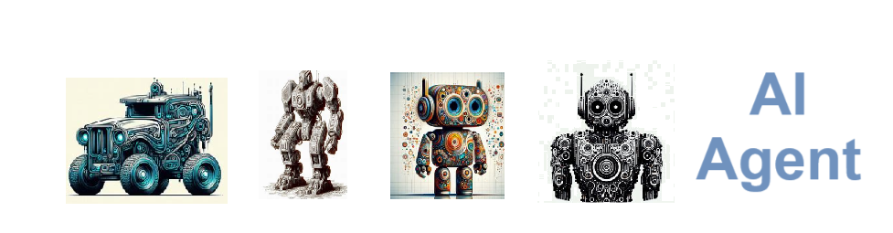

    
# Ai Agent 

## Use uagent to Create AI agents to perform workflows and LLM integrations.

    

    
## Table of Contents

- [Solution Overview](#solution-overview)
- [Who will use this ?](#who-can-use)
- [Advantages of Using](#advantages-of-using)
- [Return on Investment (ROI)](#return-on-investment-roi)
- [How it Works](#how-it-works)
- [Conclusion](#conclusion)
- [Getting Started](#getting-started)
- [Solution Features](#solution-features)
- [Code Features](#code-features)
- [Deliverables or Figures](#deliverables-or-figures)
- [Contact Information](#contact-information)

### **Autogen Library**:
The **Autogen** library is a tool or framework designed to automate processes and workflows, often utilizing **artificial intelligence (AI)** and machine learning techniques. It focuses on enabling the automatic generation and optimization of code, data structures, reports, or other outputs that are typically created manually. Autogen libraries are used in various industries to reduce human intervention, accelerate development processes, and improve the accuracy of tasks like data processing, model training, and deployment.

The library might provide features such as:
- **Automated Code Generation**: Creating source code based on user-defined inputs or templates.
- **Dynamic Workflow Automation**: Automating repetitive tasks like data transformations, testing, and continuous integration.
- **AI-Driven Optimization**: Leveraging AI algorithms to improve system efficiency, speed, or accuracy by automating decision-making processes.

Autogen libraries are commonly employed in **DevOps**, **machine learning pipelines**, and **natural language processing (NLP)** tasks to help automate complex workflows and save time for developers.

---

### **AI Agent**:
An **AI agent** refers to a software entity that acts autonomously to perform tasks, make decisions, or interact with an environment based on input data and predefined goals. AI agents are designed to mimic human decision-making, reasoning, and action-taking abilities by using artificial intelligence technologies.

#### Key Characteristics of AI Agents:
1. **Autonomy**: AI agents operate independently without continuous human intervention, making decisions based on their programming and the data they receive.
2. **Perception**: They can perceive their environment using sensors (or data inputs) and interpret that information to understand the situation.
3. **Decision-Making**: Based on the information they receive, AI agents use algorithms, rules, or machine learning models to make decisions or solve problems.
4. **Action**: After making decisions, AI agents perform actions (output) that affect the environment, other systems, or the task they are managing.
5. **Learning**: Many AI agents have the ability to learn from their experiences, improving their decision-making and performance over time (e.g., reinforcement learning agents).

#### Examples of AI Agents:
- **Virtual Assistants**: AI agents like Siri or Alexa that understand voice commands and perform tasks such as sending messages or playing music.
- **Autonomous Vehicles**: AI agents that perceive the road, make decisions about speed, lane changes, and obstacle avoidance, and act by controlling the vehicle.
- **Trading Bots**: AI agents used in financial markets to make autonomous trading decisions based on market data.
- **Customer Support Chatbots**: AI agents that simulate conversations with users to answer questions, troubleshoot issues, or provide information.

In summary, AI agents are crucial in automating tasks, improving efficiency, and enabling intelligent decision-making across a wide range of applications.

    

    
## Getting Started

The goal of this solution is to **Jump Start** your development and have you up and running in 30 minutes. 

To get started with the **Ai Agent** solution repository, follow these steps:
1. Clone the repository to your local machine.
2. Install the required dependencies listed at the top of the notebook.
3. Explore the example code provided in the repository and experiment.
4. Run the notebook and make it your own - **EASY !**
    
## Solution Features

- Easy to understand and use  
- Easily Configurable 
- Quickly start your project with pre-built templates
- Its Fast and Automated
- Saves You Time 

## Code Features

These features are designed to provide everything you need for **Ai Agent** 

- **Self Documenting** - Automatically identifes major steps in notebook 
- **Self Testing** - Unit Testing for each function
- **Easily Configurable** - Easily modify with **config.INI** - keyname value pairs
- **Includes Talking Code** - The code explains itself 
- **Self Logging** - Enhanced python standard logging   
- **Self Debugging** - Enhanced python standard debugging
- **Low Code** - or - No Code  - Most solutions are under 50 lines of code
- **Educational** - Includes educational dialogue and background material

    
## List of Figures
    
    

## Github https://github.com/JoeEberle/ - Email  josepheberle@outlook.com 
    

    